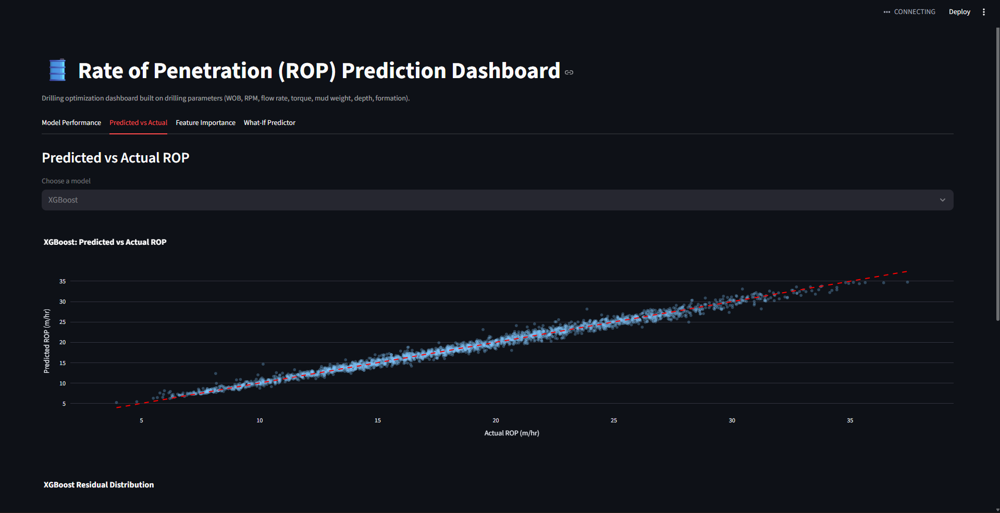
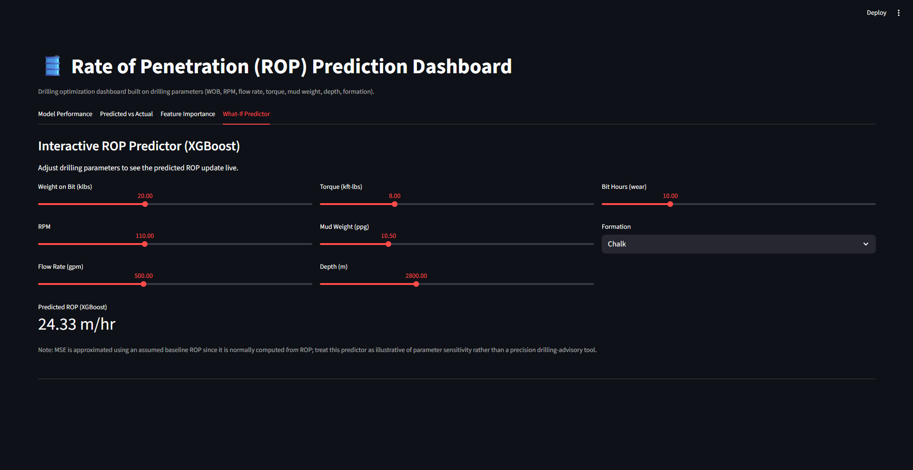

# Rate of Penetration (ROP) Prediction Using Machine Learning

End-to-end drilling-optimization project: clean drilling parameters →
EDA → train Linear Regression / Random Forest / XGBoost → evaluate →
identify influential parameters → interactive Streamlit dashboard.

## About the dataset

This project was built to run against the **Equinor Volve** public
drilling dataset, but that dataset is distributed through Equinor's own
data-sharing portal / Azure storage, which was not reachable from the
environment used to build this project (no general internet access).

To keep the project fully runnable end-to-end, `src/data_generation.py`
instead generates a **physics-informed synthetic dataset** with the exact
same schema Volve's drilling data would have (WOB, RPM, flow rate, torque,
mud weight, depth, formation, bit wear → ROP). It uses a Bourgoyne &
Young–style ROP model (the standard petroleum-engineering formulation)
plus realistic noise, formation-dependent drillability, and bit-wear
degradation, so the data behaves like real field data, not random noise.

**To use the real Volve dataset:**
1. Download drilling data from https://www.equinor.com/energy/volve-data-sharing
   (look under the "Drilling" folder — daily drilling reports / WITSML logs).
2. Extract depth-indexed WOB, RPM, standpipe pressure/flow rate, torque,
   mud weight, and formation tops into one CSV.
3. Rename columns to match `src/data_preprocessing.py`'s expected schema
   (see `COLUMNS` list in `src/data_generation.py`).
4. Save it as `data/raw/drilling_data_raw.csv`, replacing the synthetic file.
5. Re-run the pipeline (steps below) — no other code changes needed.

## Project structure

```
ROP_Prediction_Project/
├── README.md
├── requirements.txt
├── data/
│   ├── raw/drilling_data_raw.csv          # synthetic (or real Volve) raw data
│   └── processed/drilling_data_clean.csv  # cleaned + feature-engineered
├── src/
│   ├── data_generation.py     # builds the synthetic dataset (swap for real Volve data)
│   ├── data_preprocessing.py  # cleaning, imputation, outlier clipping, feature engineering
│   ├── eda.py                 # exploratory data analysis + plots
│   ├── train_models.py        # trains LR, RF, XGBoost + saves models/metrics
│   └── evaluate.py            # model comparison plots, residuals, feature importance
├── models/                    # saved .joblib models + scaler + feature list
├── reports/
│   ├── summary_statistics.csv
│   ├── model_metrics.csv
│   ├── feature_importance.csv
│   ├── predictions_vs_actual.csv
│   └── figures/                # all PNG plots (01–10)
└── app/
    └── streamlit_app.py        # interactive dashboard
```

## How to run

```bash
pip install -r requirements.txt

# 1. Generate (or replace with real Volve) raw data
python src/data_generation.py

# 2. Clean & feature-engineer
python src/data_preprocessing.py

# 3. Exploratory Data Analysis (saves plots to reports/figures/)
python src/eda.py

# 4. Train models (Linear Regression, Random Forest, XGBoost)
python src/train_models.py

# 5. Generate evaluation plots (predicted vs actual, residuals, feature importance)
python src/evaluate.py

# 6. Launch the interactive dashboard
streamlit run app/streamlit_app.py
```

## Features used

| Feature | Description |
|---|---|
| `WOB_klbs` | Weight on Bit (thousands of lbs) |
| `RPM` | Rotary speed |
| `Flow_Rate_gpm` | Mud pump flow rate |
| `Torque_kftlbs` | Rotary torque |
| `Mud_Weight_ppg` | Drilling fluid density |
| `Depth_m` | True vertical / measured depth |
| `Bit_Hours` | Hours on current bit (wear proxy) |
| `MSE_psi` | Engineered: Mechanical Specific Energy |
| `Formation_*` | One-hot encoded lithology |

Target: `ROP_m_hr` (Rate of Penetration, meters/hour).

## Results (on the synthetic dataset)

| Model | R² | RMSE (m/hr) | MAE (m/hr) |
|---|---|---|---|
| Linear Regression | 0.9625 | 1.207 | 0.961 |
| Random Forest | 0.9701 | 1.078 | 0.829 |
| **XGBoost** | **0.9861** | **0.736** | **0.559** |

XGBoost performs best, consistent with its ability to capture non-linear
interactions between drilling parameters (e.g. WOB×RPM effects, formation
thresholds) that Linear Regression cannot.

**Most influential parameters (XGBoost feature importance):**
1. Formation type (Limestone / Dolomite / Chalk — lithology drillability)
2. Mechanical Specific Energy (MSE) — drilling-efficiency composite metric
3. Bit wear (hours on bit)
4. Depth
5. WOB / Torque

This matches drilling-engineering intuition: **rock drillability and
drilling efficiency dominate ROP more than any single surface parameter
in isolation** — which is exactly why real-time MSE monitoring and
formation-aware drilling parameter optimization are standard practice on
modern rigs.

## Dashboard

The Streamlit app (`app/streamlit_app.py`) has four tabs:
1. **Model Performance** — R²/RMSE/MAE comparison across models.
2. **Predicted vs Actual** — interactive scatter + residuals per model.
3. **Feature Importance** — Random Forest vs XGBoost importances.
4. **What-If Predictor** — sliders for WOB, RPM, flow rate, torque, mud
   weight, depth, bit wear, and formation; live ROP prediction from the
   trained XGBoost model.




## Notes / limitations


- The dataset is synthetic; absolute R² values are optimistic compared to
  what you'd see on noisy real field data (real Volve data would likely
  show R² in the 0.6–0.85 range for ROP prediction, based on published
  drilling-ML literature).
- The MSE feature is normally computed *from* ROP, so it's mildly
  circular as a predictor — this is flagged in the dashboard's What-If
  tab. It's still standard practice in drilling engineering to include it
  as an efficiency indicator alongside raw parameters.
- No hyperparameter search beyond a small grid was performed, to keep
  training fast; expand `param_grid` in `train_models.py` for a more
  exhaustive search on real data.
